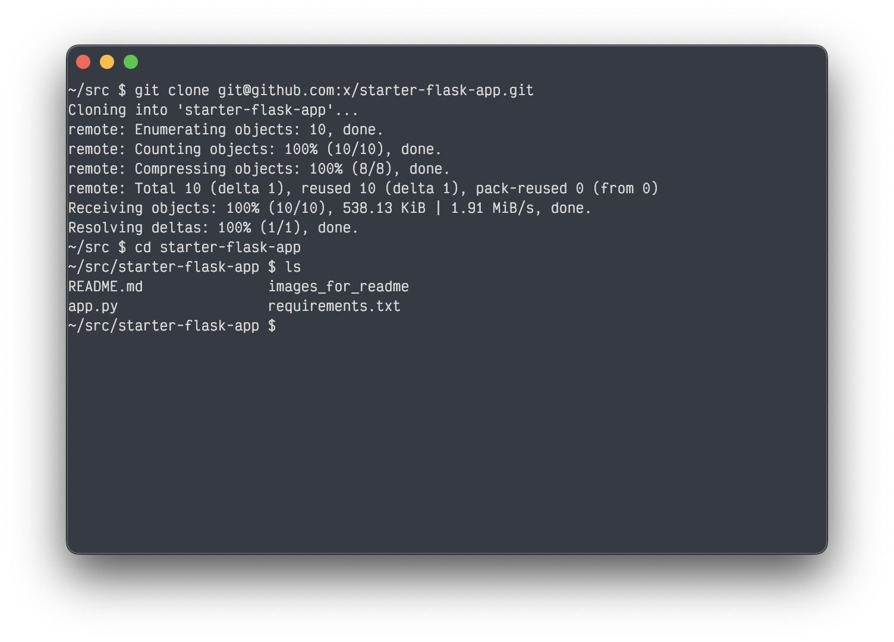
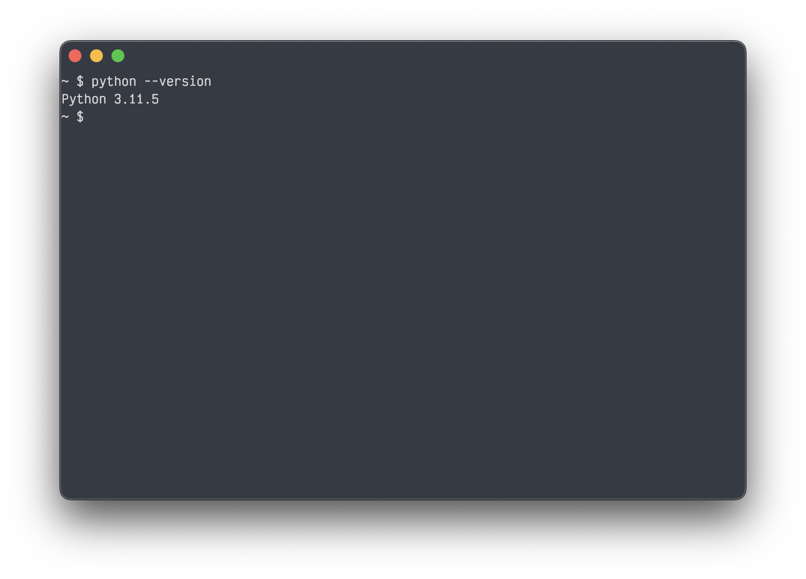
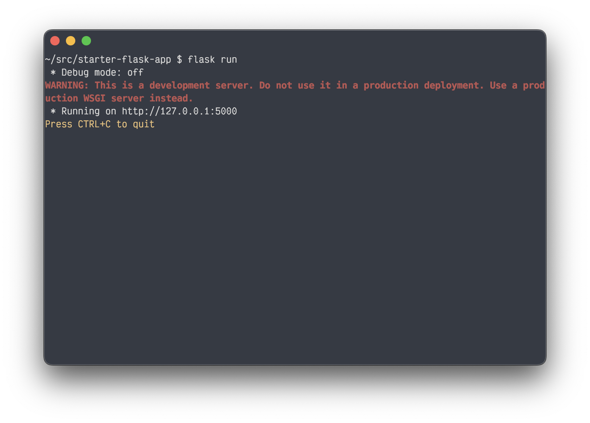
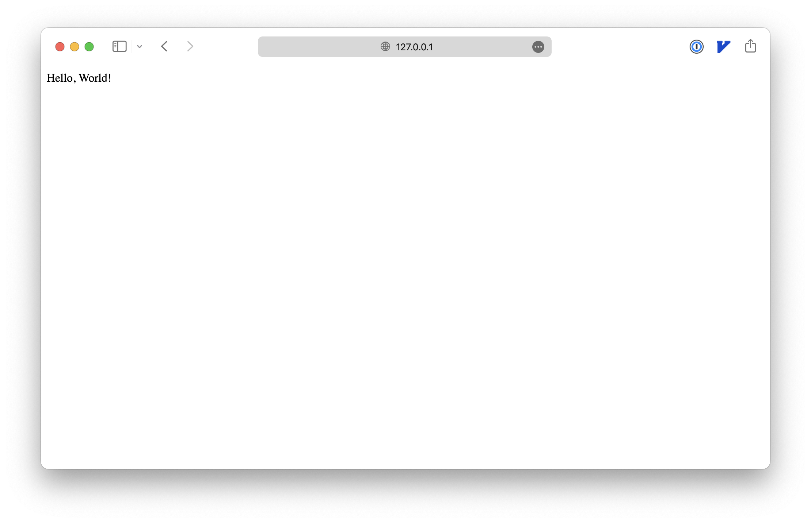

# Starter Flask App

This repo is a starter flask app for teaching purposes.


## How to Clone This Repo

1. If you haven't already, [set up git](https://docs.github.com/en/get-started/getting-started-with-git/set-up-git).
2. Click the green "Code" button in the top right corner of this page.
3. Copy the URL in the dropdown.
4. Open your terminal and navigate to the directory where you want to clone this repo.
5. Run the following command:
   ```bash
   git clone <URL>
   ```
   


## How to Run the Flask App Locally

1. If you don't already, install python and pip. If you're not sure if you have python installed, try running it locally in your command line with `python --version`.
   

2. Navigate to the directory where you cloned this repo.
3. Run the following command to install the required packages:
   ```bash
   pip install -r requirements.txt
   ```

4. Run the following command to start the flask app defined in the `app.py` file:
   ```bash
   flask run
   ```
   

5. Open your browser and navigate to [http://127.0.0.1:5000](http://127.0.0.1:5000) to see the app running locally.
   